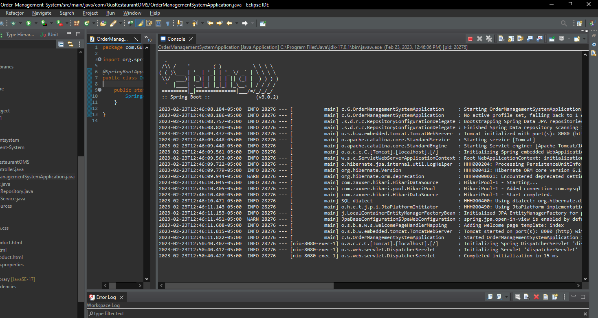

# Herzing-SE6

## Description:
It took some time for me to get Springboot working. In the course of focusing on functionality, 
I made a product manager (because it was easy) not realizing it was not one of the options.
I want you to know that I finally understand where the project is going.
Server side for customers and clients, and the JavaFX backend for Admin, Gus, managers, etc.
The Product Table is not really a good choice for server side access, but I didn't get the epiphany until the app was complete.

Please accept this submission as an example of a fully functional CRUD Springboot and Java project.

I don't know if I will have time to update or add more services before the end of this course, but I will definitely update for the next class.
Also, the Delete is just a press and "you're out of here" type of situation, so couldn't really get an image of the action.

Every phase of the Springboot CRUD project works like a charm.

## Team:
Frank James

## Springboot:

## Product Manager (running in browser):

## Create Product Page:

## Product Table After New Create:

## Edit Product Page:

## Product Table After Edit:

## MySQL: Table Schema:

## MySQL: Table Query (After Above Changes):

